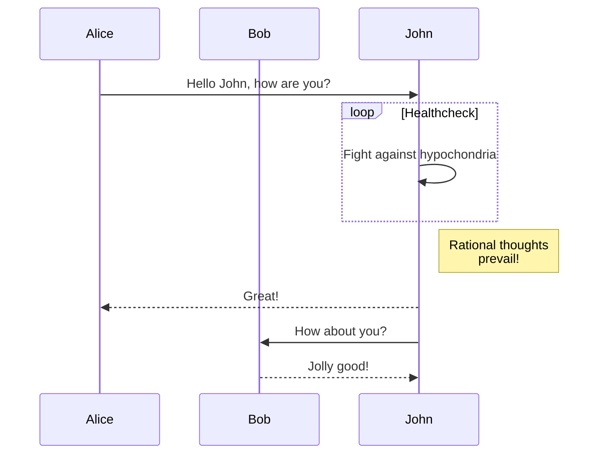

# Heading 1
## Heading 2
### Heading 3
# Heading 1.1
## Heading 2.1
### Heading 3.1

> Example line for prompt.
{: .prompt-info }

> Example line for prompt.
{: .prompt-tip }

> Example line for prompt.
{: .prompt-warning }

> Example line for prompt.
{: .prompt-danger }

```python
def some_python_code(dto: TestDto):
    print(args)

some_python_code(TestDto(name="str"))
```

