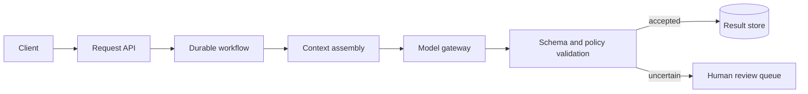

AI features are easy to demo and surprisingly hard to operate. A chat endpoint can be built in an afternoon; a system that answers with the right context, survives retries, exposes its failures and stays within a budget takes architecture.

The useful mental model is not “an LLM inside an API”. It is a workflow with an unreliable, expensive decision-maker in the middle. The rest of the system should make that decision-maker observable, constrain its permissions and keep the result reproducible enough to debug.

## Start with explicit boundaries

An AI-assisted feature usually has five responsibilities:

1. **Request handling** authenticates the caller and records a request ID.
2. **Context assembly** selects the documents, records or tools the model may use.
3. **Inference** turns a bounded prompt into a candidate result.
4. **Validation** checks structure, policy and business rules.
5. **Delivery** returns the result or routes it to a human when confidence is insufficient.

Keeping these boundaries explicit prevents prompt construction from leaking into every HTTP handler. It also makes it possible to test context selection and validation without calling a model.



The model gateway is deliberately boring. It owns provider credentials, timeouts, retries, token budgets and structured logging. Callers ask for a capability such as `summarise_ticket`; they do not know which provider or model implements it.

## Make the workflow durable

Synchronous request-response is appropriate for a short completion, but it becomes fragile when the workflow includes retrieval, several tool calls or human review. A queue-backed workflow gives each step an idempotency key and a place to resume.

```python title="application/workflows/answer_question.py"
from dataclasses import dataclass


@dataclass(frozen=True)
class AnswerRequest:
    request_id: str
    question: str


async def answer_question(request: AnswerRequest) -> str:
    context = await retrieve_context(request.question)
    candidate = await model_gateway.complete(
        capability="answer_question",
        input={"question": request.question, "context": context},
        idempotency_key=request.request_id,
    )
    answer = Answer.model_validate(candidate)
    await answer_policy.check(answer, context=context)
    await answers.save(request.request_id, answer)
    return answer.text
```

The important detail is not the Python syntax. Every external side effect has a stable key. If a worker times out after saving an answer but before acknowledging the message, the retry should converge on the same result rather than creating a duplicate.

## Treat context as a product decision

Retrieval quality is often more important than model size. A large context window does not fix stale, duplicated or badly permissioned documents. Before tuning embeddings, define:

- which source is authoritative;
- how document permissions map to the requesting user;
- how freshness is measured;
- what evidence must be shown with the answer;
- what happens when no useful context is found.

Context assembly should return structured evidence, not just a concatenated string. That gives the validator and the UI enough information to reject unsupported claims and show citations.

> **Info:** If the system cannot explain which source supported an answer, treat that as a missing feature rather than a prompt-writing problem.

## Validate twice

There are two different things to validate:

1. **Shape:** can the output be parsed into the contract the rest of the system expects?
2. **Meaning:** does it satisfy policy and domain rules?

Pydantic handles the first part well. The second part may require deterministic checks, a domain service or a human. A valid JSON response can still recommend an action the user is not allowed to take.

Validation should produce useful telemetry: the rule that failed, the model version, the retrieved evidence IDs and the latency/cost of each step. Avoid logging raw private prompts by default; log hashes or redacted fields where possible.

## Evaluate before optimising

Start with a small, versioned evaluation set drawn from real failure modes. It should include ambiguous questions, missing context, permission boundaries, adversarial instructions and long inputs. Run it in CI for prompt or model changes, but keep the threshold visible and review failures instead of hiding them behind an aggregate score.

The architecture should make these questions answerable:

- Did the new prompt improve grounded answers or merely increase verbosity?
- Which documents caused the regression?
- Did latency or cost change for the same request distribution?
- Can a reviewer reproduce the exact input, model and tool results?

## The trade-off

This design adds queues, schemas and a review path to a feature that could initially be one function. That is intentional when the output affects users, data or money. For a low-risk internal prototype, a synchronous model gateway may be enough. The boundary lets the prototype grow without forcing the HTTP layer to become the workflow engine.

The goal is not to make the model deterministic. The goal is to make uncertainty visible, bounded and recoverable.
