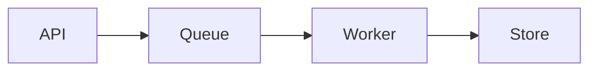

This draft is a private rendering reference, not a published article.

```python title="worker.py" {1,4} ins={5}
from dataclasses import dataclass

@dataclass(frozen=True)
class Job:
    name: str
```

```diff title="config.diff"
- timeout = 10
+ timeout = 30
```


